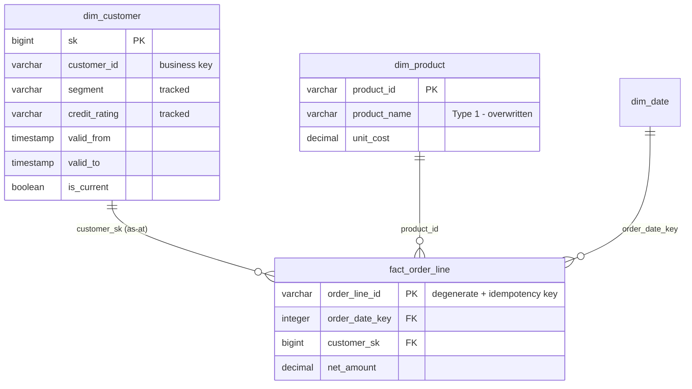

# Incremental ELT Warehouse

[](https://github.com/Fariz7154/incremental-elt-warehouse/actions/workflows/ci.yml)

A dimensional warehouse loaded incrementally: watermark-based extraction with a
lookback window, SCD Type 2 history on the customer dimension, idempotent fact
loading, and validation that the history is actually well-formed after every run.

The interesting part is not the star schema. It is what happens on the **second
and third** run — which is where incremental loading either works or quietly
corrupts a year of reporting.

```
$ make demo

  incremental load complete
  high-water mark     2026-02-07 06:00:00
  dim_customer        inserted=1 versioned=56 updated=0 unchanged=4
  dim_product         inserted=0 versioned=0 updated=15 unchanged=0
  fact_order_line     read=4842 inserted=1 restated=4841
  inferred members    0
  history validation  clean
```

## The model



Grain: one row per order line. Customer is Type 2 because a segment
reclassification must not restate last quarter. Product is Type 1 because a
corrected product name is a correction, not history.

## Three decisions that carry the design

### 1. New dimension members open at the beginning of time

This one is easy to get wrong and brutal when you do.

If a first-seen member opens at the *load* timestamp, every fact that predates
the load falls before the dimension's validity window, misses the as-at join,
and silently lands on the Unknown member. On a first full load that is the
entire fact table — and every other integrity check still passes. No nulls, no
orphan keys, no constraint violation. Just a warehouse where all revenue belongs
to "Unknown".

So a member seen for the first time opens at `1900-01-01`: the warehouse has no
evidence its attributes were ever different. Observed *changes* are versioned at
the moment they were observed. `tests/test_incremental_load.py` asserts no fact
ever lands on the Unknown member.

### 2. A lookback window, paid for by idempotency

The failure mode of every watermark-based extract is the back-dated write — a
correction stamped with the original transaction time rather than the moment it
was made. It lands behind the mark and is never seen again.

So the extract window starts `lookback` *before* the watermark, while the
watermark itself still advances to the new high-water mark. Re-reading a
trailing window is only affordable because the loads are idempotent: the fact
load is delete-then-insert on the natural key, so re-processing a row replaces
it rather than duplicating it. The lookback costs compute and nothing else.

There is a test for the counterexample, not just the fix —
`test_zero_lookback_would_miss_the_back_dated_correction` asserts the bug is
real when the window is closed.

### 3. Dimensions before facts, and one high-water mark per run

Facts need the surrogate key of the dimension version that was live *when the
event happened*, so dimensions load first. And the high-water mark is captured
once for the whole run rather than per table — read it per statement and a row
written between two statements falls into the gap: after this table's mark,
before the next one's, skipped by both this run and the next.

## SCD Type 2, and the three ways to get it wrong

| Failure | What it looks like later | Guard |
|---|---|---|
| Closing the wrong version | Two current rows for one key; every join doubles | `validate_history` |
| Overlapping validity windows | As-at joins double-count or find nothing | `validate_history` |
| Null-blind change detection | Nullable attributes never version — `a <> b` is NULL when either side is | `IS DISTINCT FROM` |

The null one is the subtle one. `segment <> 'SME'` is NULL when `segment` is
NULL, and NULL is not true, so a plain comparison treats every nullable
attribute as unchanged *forever*. The loader uses `IS DISTINCT FROM` throughout,
and there are tests for both directions — null to value, and value to null.

`validate_history()` runs after every load and checks four invariants: exactly
one current version per key, no key without a current version, no overlapping
windows, no inverted windows. Cheap, and the only way these defects get noticed
before a restated report goes out.

## Run it

```bash
make setup    # venv + duckdb
make demo     # seed the source, load, mutate the source, load again
make test     # 39 tests
make inspect  # warehouse contents, run log, revenue by segment
```

What the demo does, in order:

```bash
warehouse seed      # 800 customers, 200 products, 12k order lines over 5 days
warehouse load      # cold start: full load, watermark advances
warehouse change    # 60 reassessed customers, 15 renamed products,
                    # 120 restated order lines, 1 back-dated correction
warehouse load      # incremental: versions, overwrites, restates
warehouse inspect
```

The second load reports `versioned=56` against 60 reassessed customers — the
other four were reassigned to the values they already had, and correct change
detection treats them as unchanged rather than manufacturing empty versions.

## Layout

```
src/warehouse/
  watermark.py   watermark store, lookback window, run log
  scd.py         Type 1 and Type 2 loaders, history validation
  loader.py      orchestration: dims before facts, as-at surrogate resolution
  source.py      simulated operating system that changes between loads
  cli.py         seed / load / change / inspect
models/
  star_schema.sql
tests/           39 tests: SCD2 semantics, watermark behaviour, end-to-end loads
```

## Notes

DuckDB so it runs from a clone with no infrastructure. The logic is ordinary
SQL and Python — the same watermark, SCD and idempotency patterns are what an
ADF or Airflow implementation orchestrates; only the runner changes.

## Licence

MIT
